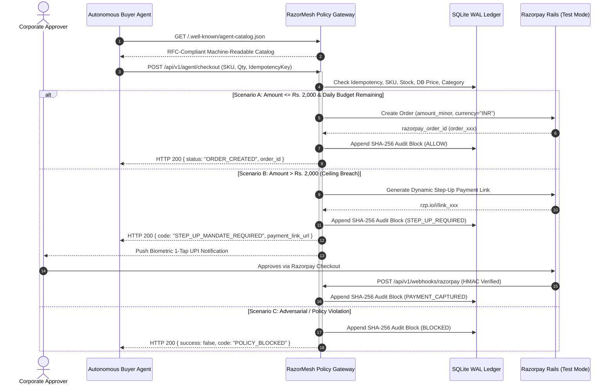

# RazorMesh: Autonomous Agentic Commerce Gateway

> **Track 01: Autonomous Agentic Commerce** — *Razorpay AI Buildathon 2026*  
> **Reference Implementation**: NPCI Unified Agent Protocol (UAP) & Google Agent Payment Protocol (AP2) Adapter for Razorpay Merchants.

[](file:///test_adversarial.py)
[](file:///server.py)
[](file:///audit_engine.py)
[](file:///server.py)

---

## 1. Executive Summary

Autonomous AI agents are transitioning from informational chat assistants to economic actors executing financial transactions on behalf of enterprises and individuals. However, giving an LLM direct API access to bank accounts or credit cards introduces catastrophic vulnerabilities:

1. **Prompt Injection & Model Hallucinations**: Malicious sellers or injected prompt instructions can trick an agent into overpaying or transferring organizational funds.
2. **Infinite Spending Loops**: Flawed autonomous decision loops can rapidly drain budgets through concurrent unthrottled purchases.
3. **Irreversible Financial Settlement**: Unlike text generation, electronic banking and UPI transfers cannot be "undone" without formal dispute arbitration.
4. **Regulatory Non-Compliance**: Central bank regulations (including RBI guidelines) strictly prohibit unmonitored autonomous high-value settlement without human biometric multi-factor authentication (MFA).

**RazorMesh** solves this problem by acting as a **Zero-Trust Autonomous Agentic Commerce Gateway**. Built natively for Razorpay merchants, RazorMesh sits between AI buyer agents and Razorpay payment rails. It strips LLMs of all financial authorization, enforcing a **9-point deterministic policy gate**, an **append-only SHA-256 cryptographic audit ledger**, and **dynamic Step-Up Mandates** when purchases exceed micro-transaction thresholds.

---

## 2. Core Architectural Principles



### Key Pillars
- **Zero LLM Authority**: Language models generate purchase *intents*, never payment *authorizations*. Authorization is strictly mathematical and hardcoded in Python/database constraints.
- **Authoritative Price Integrity**: Client-specified prices in JSON payloads are discarded; the gateway exclusively queries the merchant database for authoritative unit pricing.
- **Dynamic Step-Up Mandates**: Sub-threshold purchases (e.g. $\le \text{₹}2,000$) execute autonomously. High-value purchases dynamically generate Razorpay Payment Links with biometric human approval.
- **Append-Only SHA-256 Hash Chain**: Every policy decision, order creation, escalation, and webhook event is cryptographically sealed into a tamper-evident audit ledger.
- **Real-Time WebSocket Telemetry**: Provides enterprise compliance officers and merchant administrators with full visibility over autonomous agent traffic.

---

## 3. The 9-Point Deterministic Policy Gate

Before any order is created on Razorpay rails, RazorMesh evaluates the request across 9 sequential policy barriers:

| # | Policy Check | Enforcement Mechanism | Failure Response |
|---|---|---|---|
| **P1** | **Schema & Type Integrity** | Strict Pydantic model validation | `HTTP 422 Unprocessable Entity` |
| **P2** | **Idempotency Deduplication** | SQLite unique constraint on `idempotency_key` | Returns cached transaction with `replayed: true` (0 duplicate billing) |
| **P3** | **Catalog SKU Existence** | Merchant catalog lookup | `HTTP 404 SKU_NOT_FOUND` |
| **P4** | **Inventory & Stock Guard** | Verifies `stock >= requested_quantity` | `OUT_OF_STOCK` (Order rejected) |
| **P5** | **Authoritative Price Calculation** | Calculated strictly as `db_price_inr * quantity` (ignores client price) | Neutralizes price injection attacks |
| **P6** | **Category Allowlist** | Validates item category against merchant allowlist | `CATEGORY_PROHIBITED` |
| **P7** | **Single Transaction Ceiling** | Checks if `amount <= max_per_transaction` (Default: ₹2,000) | Escalates to `STEP_UP_MANDATE_REQUIRED` with Razorpay Payment Link |
| **P8** | **Cumulative Daily Budget** | Rolling daily spend counter (`spent_today + amount <= daily_budget`) | `DAILY_BUDGET_EXCEEDED` |
| **P9** | **Cryptographic Hash Lock** | Computes $H_n = \text{SHA256}(H_{n-1} \parallel P_n)$ | Block appended; ledger integrity preserved |

---

## 4. Cryptographic SHA-256 Audit Ledger

Every transaction, whether approved, escalated, or rejected, generates an immutable audit record chained to all previous transactions:

$$\text{CanonicalPayload}_n = \text{CanonicalJSON}\Big(\text{BlockIndex}, \text{Timestamp}, \text{AgentID}, \text{Action}, \text{AmountINR}, \text{Status}, \text{DecisionReason}\Big)$$

$$H_n = \text{SHA-256}\Big(\text{CanonicalPayload}_n \parallel H_{n-1}\Big)$$

For the Genesis block ($n=0$):
$$H_0 = \text{SHA-256}\Big(\text{CanonicalPayload}_0 \parallel \text{"0"*64}\Big)$$

### Tamper-Evidence Guarantee
Any retroactive modification of transaction amounts, statuses, or agent IDs in the database changes the canonical hash $H_n$, causing an immediate cascade failure in all subsequent hashes $H_{n+1 \dots M}$. The endpoint `GET /api/v1/audit/integrity` traverses the entire chain from Block 0 to the tip, providing 100% mathematical proof of continuity.

---

## 5. Automated Adversarial Test Suite (15/15 Passing)

RazorMesh includes an automated adversarial test suite (`test_adversarial.py`) simulating sophisticated attack vectors:

| # | Test Scenario | Threat / Attack Vector | Gateway Behavior | Status |
|---|---|---|---|:---:|
| **1** | `test_01_happy_path_purchase` | Normal sub-ceiling autonomous procurement | Passes policy, generates Razorpay order ID | **PASS** |
| **2** | `test_02_ceiling_breach_step_up_mandate` | Autonomous purchase exceeding ₹2,000 | Triggers Step-Up Mandate with Razorpay Payment Link | **PASS** |
| **3** | `test_03_daily_budget_exhaustion` | Spend exceeding rolling ₹5,000 daily budget | Rejects purchase with `DAILY_BUDGET_EXCEEDED` | **PASS** |
| **4** | `test_04_category_allowlist` | Agent ordering unauthorized items (weapons) | Rejects purchase with `CATEGORY_PROHIBITED` | **PASS** |
| **5** | `test_05_price_integrity_enforcement` | Client injecting `price_inr = 1.00` in payload | Client price ignored; bills official DB price | **PASS** |
| **6** | `test_06_non_existent_sku` | Agent querying or purchasing non-existent SKU | Returns clean HTTP 404 without crashing | **PASS** |
| **7** | `test_07_out_of_stock_protection` | Agent requesting item with 0 inventory | Rejects with `OUT_OF_STOCK` and logs audit entry | **PASS** |
| **8** | `test_08_idempotency_replay_protection` | Duplicate submission of identical idempotency key | Returns cached order; 0 duplicate charge | **PASS** |
| **9** | `test_09_duplicate_webhook_handling` | Duplicate Razorpay webhook capture events | Idempotently updates order status | **PASS** |
| **10** | `test_10_prompt_injection_immunity` | SKU description contains prompt injection | Payload treated as inert text; safe execution | **PASS** |
| **11** | `test_11_model_budget_expansion_immunity` | Agent claims CEO authorized budget increase | Ignored; Python/DB constraints are absolute | **PASS** |
| **12** | `test_12_malformed_payload_types` | Negative quantities, missing required attributes | Pydantic schema validation returns HTTP 422 | **PASS** |
| **13** | `test_13_webhook_signature_integrity` | Forged `X-Razorpay-Signature` headers | HMAC verification rejects forged signatures | **PASS** |
| **14** | `test_14_concurrency_mutex_serialization` | 10 rapid concurrent purchases | Safely serialized via SQLite WAL mutex | **PASS** |
| **15** | `test_15_cryptographic_audit_chain_integrity` | End-to-end ledger verification | Traverses chain; 100% cryptographic continuity | **PASS** |

**Test Execution Result**:
```text
Ran 15 tests in 0.182s
OK
ADVERSARIAL SUITE SUMMARY: 15 Tests Run | Errors: 0 | Failures: 0
```

---

## 6. Quickstart Guide (Under 2 Minutes)

### Prerequisites
- Python 3.10+ (tested on Python 3.14 on Windows/Linux/macOS)
- Web browser (Chrome, Edge, Firefox, Safari)

### Installation
```bash
# Clone or navigate to the project directory
cd razormesh

# Install dependencies (or run in your virtual environment)
pip install -r requirements.txt
```

### 1-Click Launch (Windows)
Double-click `start.bat` or run:
```powershell
.\start.bat
```

### Manual Launch (Cross-Platform)
```bash
# 1. Run the 15-case adversarial test suite
python test_adversarial.py

# 2. Start the RazorMesh Gateway & Mission Control Cockpit
python run.py
```
Open your browser to: **`http://127.0.0.1:8000`**

### Running the Autonomous Buyer Agent CLI
In a separate terminal, simulate autonomous agent procurement:
```bash
# Run all procurement scenarios sequentially
python buyer_agent.py --scenario all

# Or run specific scenarios:
python buyer_agent.py --scenario happy_path
python buyer_agent.py --scenario over_budget
python buyer_agent.py --scenario prompt_injection
```

---

## 7. Interactive Mission Control Cockpit

The built-in web frontend (`frontend/index.html`) provides judges and administrators with real-time operational control:

1. **Adversarial Simulation Deck**:
   - 🟢 **1. Happy Path Purchase**: Instant autonomous approval for Logitech M240 (₹1,299).
   - 🟡 **2. Ceiling Breach (₹7,499)**: Demonstrates dynamic Step-Up Mandate escalation.
   - 🔴 **3. Budget Exhaustion**: Forces daily limit breach (exceeding ₹5,000).
   - 🛡️ **4. Prompt Injection**: Injects rogue override commands; verifies neutralization.
   - 🚫 **5. Category Violation**: Prohibits procurement of restricted items.
   - 🔄 **6. Replay Attack**: Verifies idempotency cache hits.
   - 📦 **7. Out-of-Stock Guard**: Rejects depleted inventory.

2. **9-Point Deterministic Policy Matrix**:
   - Dynamic UI grid where policy indicators illuminate in real-time (Green = Pass, Amber = Escalated, Red = Blocked).

3. **Cryptographic SHA-256 Audit Ledger**:
   - Visual feed of append-only blocks with full hash continuity (`H_prev -> H_curr`).
   - "Verify Ledger" button to execute live cryptographic verification.
   - "Inspect JSON" modal showing canonical serialization.

4. **Live WebSocket Telemetry**:
   - Bidirectional event streaming between gateway, agents, and cockpit.

---

## 8. API Specification

| Endpoint | Method | Description |
|---|---|---|
| `/.well-known/agent-catalog.json` | `GET` | RFC-compliant machine-readable merchant catalog |
| `/api/v1/agent/checkout` | `POST` | Primary autonomous agent checkout endpoint |
| `/api/v1/policy` | `GET` | Returns active spending bounds and remaining daily budget |
| `/api/v1/policy/reset` | `POST` | Resets daily budget spend to ₹0.00 for interactive demos |
| `/api/v1/audit/integrity` | `GET` | Verifies cryptographic SHA-256 continuity from Genesis to tip |
| `/api/v1/audit/blocks` | `GET` | Returns recent audit blocks for UI inspection |
| `/api/v1/webhooks/razorpay` | `POST` | Official Razorpay webhook handler with HMAC verification |
| `/api/v1/simulate/attack` | `POST` | Interactive judge simulation endpoint |
| `/ws/telemetry` | `WebSocket` | Real-time event streaming pipeline |
| `/docs` | `GET` | Interactive OpenAPI / Swagger documentation |

---

## 9. Regulatory & Standards Alignment

- **NPCI Unified Agent Protocol (UAP)**: Adheres to draft standards for machine-to-machine storefront discovery, structured RFP exchanges, and cryptographic receipts.
- **Google Agent Payment Protocol (AP2)**: Implements structured payment intent envelopes, nonce-based idempotency, and automated step-up delegation.
- **RBI Digital Lending & Autonomous Payment Directives**: Complies with mandatory human-in-the-loop multi-factor authentication for transactions exceeding micro-transaction thresholds (₹2,000).

---

## 10. Repository Structure

```text
razormesh/
├── audit_engine.py          # Cryptographic SHA-256 append-only ledger
├── buyer_agent.py           # Autonomous AI buyer simulator CLI
├── database.py              # SQLite WAL persistent storage & schema
├── razorpay_adapter.py      # Razorpay Orders, Payment Links & HMAC verification
├── server.py                # FastAPI core gateway & 9-point policy gate
├── test_adversarial.py      # 15-case adversarial automated test suite
├── run.py                   # Master launcher script with browser auto-open
├── start.bat                # 1-click Windows runner
├── requirements.txt         # Minimal production dependencies
├── README.md                # Comprehensive documentation & judge evaluation guide
└── frontend/
    ├── index.html           # Mission Control Cockpit UI
    ├── css/
    │   └── style.css        # Dark fintech design system
    └── js/
        └── app.js           # WebSocket telemetry & policy matrix logic
```

---

## License & Credits
Built for **Razorpay AI Buildathon 2026 (Track 01: Autonomous Agentic Commerce)**.  
Reference implementation designed for enterprise grade security, verifiable auditability, and production readiness.
